# Predicting Tumor Mutational Burden from Clinical and Genomic Features Across Cancer Types

## Abstract

Tumor mutational burden (TMB), defined as the number of somatic mutations per megabase of coding DNA, has emerged as a tissue-agnostic biomarker for immune checkpoint inhibitor eligibility. This report presents a regression-based analysis of TMB variation across The Cancer Genome Atlas (TCGA) Pan-Cancer Atlas cohort, integrating clinical demographics, microsatellite instability (MSI) status, and copy-number features into unified linear and logistic models. The final processed cohort contains 10,953 samples spanning 30 cancer types, with 11.5% classified as TMB-high (>= 10 mut/Mb). Progressive multiple regression reveals that cancer type and MSI status jointly explain the majority of variance in log-transformed TMB (adjusted R-squared = 0.62 after excluding hypermutators), while age, whole-genome doubling, and fraction genome altered contribute smaller but statistically significant incremental signal. Firth's penalized logistic regression achieves an AUC of 0.921 for TMB-high classification, providing finite coefficient estimates even in cancer subtypes with complete separation. These results quantify the relative contributions of routinely available clinicogenomic variables to TMB variation and highlight MSI testing as a practical triage tool for identifying patients likely to benefit from immunotherapy.

## 1. Introduction

Tumor mutational burden has become one of the most clinically consequential biomarkers in oncology. Tumors with elevated TMB tend to produce more neoantigens, making them more visible to the immune system and more responsive to immune checkpoint inhibitor therapies such as pembrolizumab. In 2020, the FDA approved pembrolizumab for any solid tumor with TMB >= 10 mutations per megabase, making TMB one of the few tissue-agnostic biomarkers guiding treatment decisions (Marabelle et al., 2020). Despite this clinical significance, the factors driving variation in TMB across patients and cancer types have not been systematically quantified in a unified regression framework. While certain mutational processes, such as mismatch repair deficiency and ultraviolet radiation exposure, are known to elevate TMB, the relative contributions of routine clinical variables and readily available genomic features remain poorly characterized.

This project addresses three research questions. First, which patient-level variables explain the largest share of variation in TMB? Second, how well can a parsimonious model identify TMB-high tumors? Third, how sensitive are inferences to heavy-tailed outliers such as hypermutators? We approach these questions using a TCGA Pan-Cancer dataset that combines clinical demographics, mutation counts, MSI metrics, and copy-number summaries, analyzed through progressive linear regression, interaction modeling, and Firth's bias-corrected logistic regression.

### 1.1 Prior Work

Several prior studies have characterized TMB variation using the TCGA Pan-Cancer Atlas and related datasets, though none have adopted the unified progressive regression framework used here. Chalmers et al. (2017) analyzed over 100,000 cancer genomes from the FoundationOne CDx panel and established the landscape of TMB across cancer types, demonstrating wide variation and identifying melanoma, lung, and bladder cancers as consistently high-TMB disease groups. Their analysis was descriptive rather than regression-based and did not attempt to quantify the relative contributions of clinical covariates. Samstein et al. (2019) linked TMB to immunotherapy outcomes across 1,662 patients treated with checkpoint inhibitors, establishing that higher TMB correlates with improved overall survival across most cancer types, but did not model TMB itself as a dependent variable. Hoadley et al. (2018) performed an integrated molecular classification of TCGA tumors, showing that cell-of-origin patterns dominate molecular subtypes, which motivates our inclusion of cancer type as the primary predictor. The TCGA Pan-Cancer Atlas publications by Liu et al. (2018) and Taylor et al. (2018) provided the clinical and copy-number datasets used here but did not perform regression analyses on TMB. Our contribution is to integrate these data sources into a single regression framework that quantifies the incremental explanatory power of each variable, tests for biologically motivated interactions, and applies Firth's penalized logistic regression to handle the quasi-complete separation that arises in rare cancer subtypes.

## 2. Data Sources and Cohort Construction

### 2.1 Raw Data Sources

Three publicly available datasets from the TCGA Pan-Cancer Atlas are combined. The first is the TCGA Pan-Cancer Clinical Data Resource (TCGA-CDR), a standardized clinical dataset compiled by Liu et al. (2018) containing demographic variables including age at diagnosis, sex, and race, along with tumor staging and survival endpoints for 11,160 patients. The second source is mutation count data from cBioPortal, which provides per-sample total mutation counts derived from whole-exome sequencing across 32 Pan-Cancer Atlas studies. From cBioPortal, the pipeline extracts a focused set of clinical attributes: mutation count, fraction genome altered, aneuploidy score, MSI scores (MANTIS and MSIsensor), cancer type, and detailed cancer type classification. These attributes are pivoted from long format to one row per sample. The third source is the TCGA copy number and aneuploidy dataset from Taylor et al. (2018), which includes per-sample aneuploidy scores, fraction of genome altered, whole-genome doubling (WGD) status, and purity and ploidy estimates from the ABSOLUTE algorithm.

### 2.2 Merge and Feature Engineering

The three datasets are linked by TCGA patient barcode after harmonizing barcode formats (extracting the first 12 characters of sample IDs) and de-duplicating to one row per patient. The merge uses cBioPortal as the anchor table to preserve maximum coverage of mutation-based variables, with TCGA-CDR and Taylor et al. data joined via left joins. The following derived variables are central to the analysis:

- **TMB** = mutation count / 30 Mb (the approximate whole-exome capture size)
- **log(TMB)** = log(1 + TMB), used as the response variable for linear regression
- **TMB-high** = indicator for TMB >= 10 mut/Mb, used for logistic regression
- **Hypermutator** = indicator for TMB > 50 mut/Mb, used to flag extreme outliers

MSI status is derived primarily from MANTIS score thresholds (MSI-H if score >= 0.4, else MSS) and secondarily from MSIsensor (>= 3.5) when MANTIS is unavailable. Whole-genome doubling status is binarized from genome-doubling annotations in the Taylor et al. data. Age, sex, and cancer type are harmonized across the three sources.

### 2.3 Processed Cohort

The merged dataset contains 10,953 samples with 104 variables across 30 cancer type categories. The largest disease groups are breast cancer (n = 1,084), non-small cell lung cancer (n = 1,053), esophagogastric cancer (n = 622), colorectal cancer (n = 594), and endometrial cancer (n = 586). TMB-high prevalence across the full cohort is 11.5% (1,255 of 10,953 samples), and hypermutator prevalence is 1.7% (188 samples). For the core multivariable model including all seven predictors (age, cancer type, sex, MSI status, aneuploidy score, fraction genome altered, and WGD status), 9,015 complete cases are available with MSI status included, and 9,568 without.

### 2.4 Missingness

Missingness is uneven across variables. Log-TMB is missing for 7.9% of samples (863 patients lacking mutation counts), age at diagnosis is missing for 1.3% (138), aneuploidy score for 4.8% (523), and fraction genome altered for 1.8% (200). MSI status, as derived from MANTIS thresholds, is available for all samples, though the underlying MANTIS scores are missing for 11.3% (1,241). Several non-core clinical fields (e.g., recurrence details, margin status) show substantially higher missingness and are not used as predictors. All regression models use complete-case analysis on the relevant predictor set.

## 3. Exploratory Data Analysis

Raw TMB exhibits pronounced right-skew (skewness = 12.754), with a median of 1.97 mut/Mb, a mean of 7.06 mut/Mb, and a maximum of 856.6 mut/Mb. The 75th percentile is 4.47 mut/Mb, indicating that the FDA threshold of 10 mut/Mb falls well into the upper tail. Log-transformation using log(1 + TMB) substantially reduces skewness to 1.533, improving the suitability of the response for linear modeling, though residual non-normality persists due to a heavy right tail driven by MSI-H and POLE-mutant hypermutators (Figure 1).

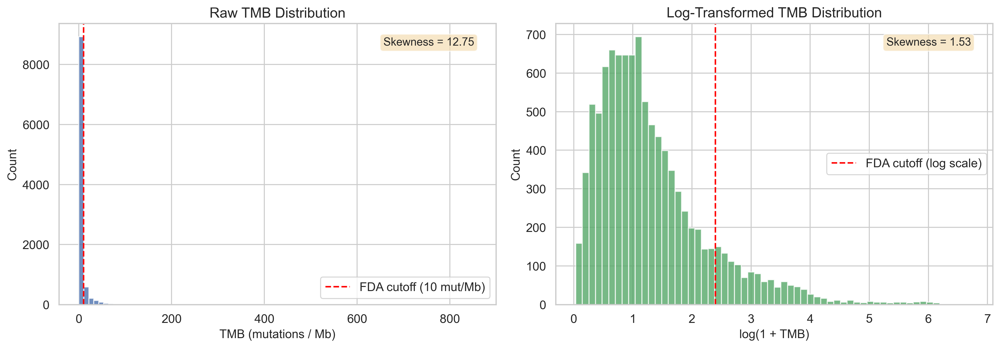

Between-cancer-type variation in TMB is substantial (Figures 2-3). Melanoma and endometrial cancer show the highest median log-TMB, consistent with known biology: melanoma accumulates mutations from ultraviolet radiation-induced damage, while endometrial cancer frequently harbors mismatch repair deficiency. At the other extreme, germ cell tumors, pheochromocytoma, and ocular melanoma have very low TMB. TMB-high prevalence varies dramatically, from over 50% in melanoma to 0% in five cancer types (pleural mesothelioma, seminoma, pheochromocytoma, non-seminomatous germ cell tumors, and miscellaneous neuroepithelial tumors) (Figure 4).

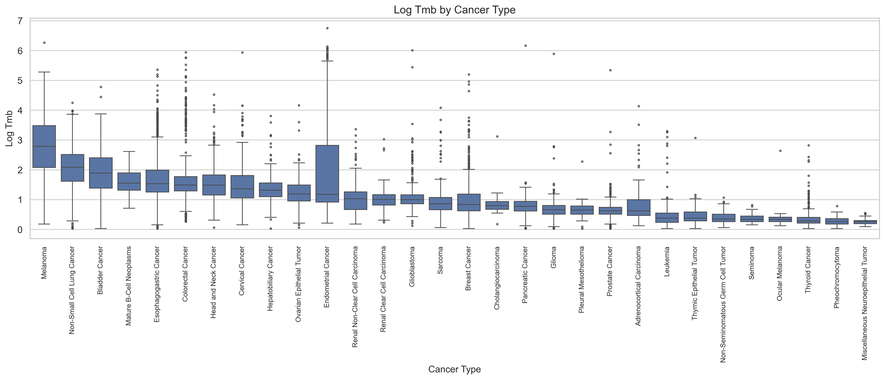

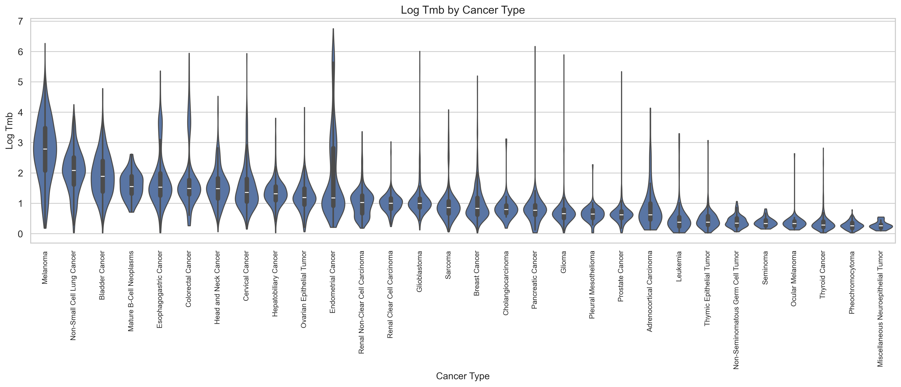

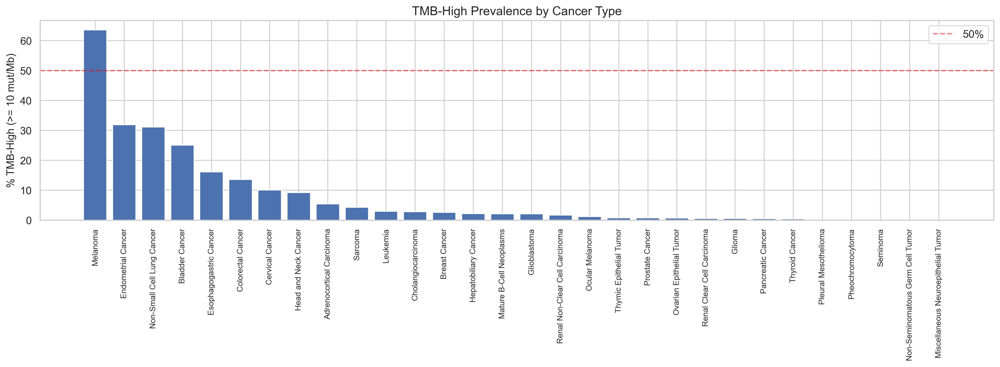

Predictor distributions are examined prior to modeling. Among continuous predictors, age at diagnosis is approximately normally distributed (median ~60 years), while aneuploidy score and fraction genome altered are right-skewed with modes near zero. Categorical predictors show imbalanced classes: the cohort is roughly balanced by sex, but MSI-H tumors comprise only a small minority and WGD-positive tumors account for approximately one-third of samples (Figures 5-6).

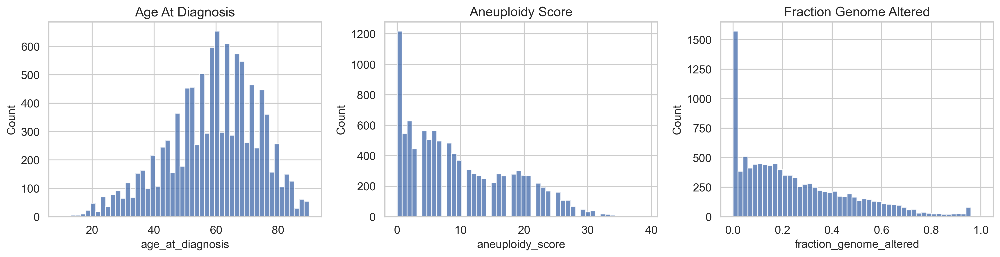

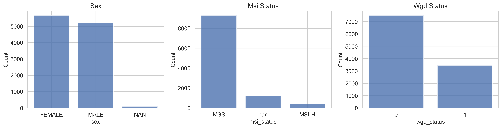

MSI-H tumors tend to have markedly higher TMB than MSS tumors, reflecting the elevated point mutation rate caused by defective DNA mismatch repair (Figure 7). Aneuploidy score and fraction genome altered are positively correlated with each other (both measure genomic instability at different scales) but show weaker and more complex relationships with TMB (Figure 10). The correlation heatmap reveals that aneuploidy and FGA are moderately correlated, motivating multicollinearity assessment in the regression models (Figure 9).

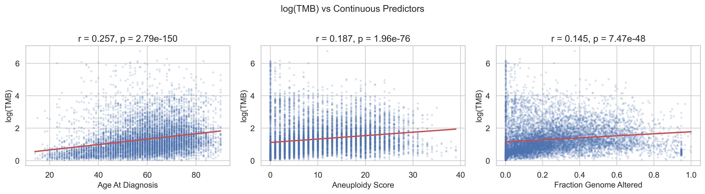

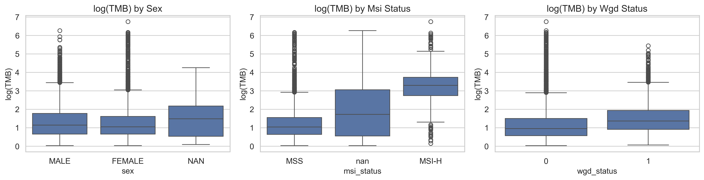

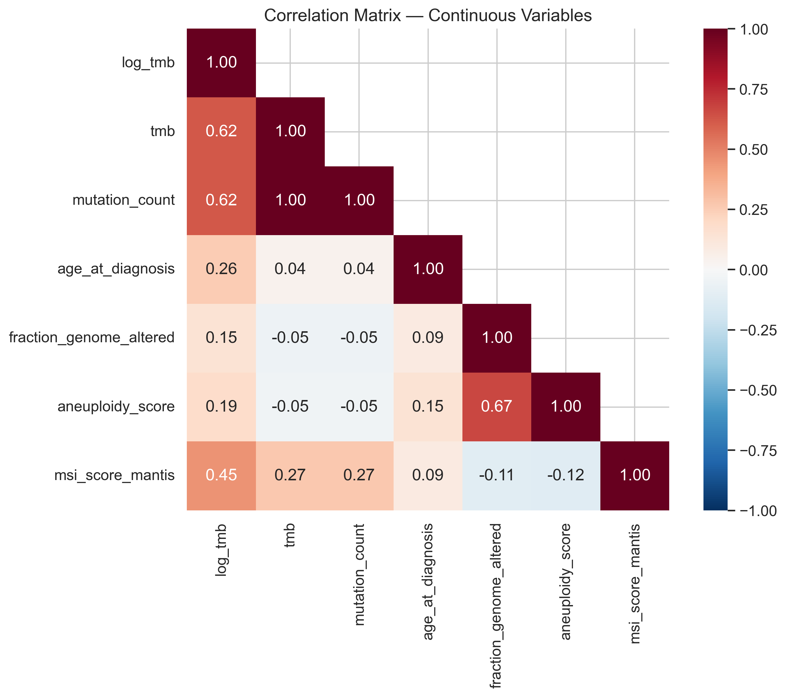

## 4. Linear Regression Results

### 4.1 Progressive Model Building

We fit a sequence of nested OLS models on log-transformed TMB, progressively adding predictors to quantify each variable's incremental contribution. Results are reported for both the full cohort and the subset excluding hypermutators (TMB > 50 mut/Mb).

On the full cohort (n = 9,015 with MSI included):

| Model | Predictors Added | Adjusted R-squared | Delta |
|-------|-----------------|-------------------|-------|
| M1 | Age | 0.0650 | +0.065 |
| M2 | + Cancer type | 0.4444 | +0.379 |
| M3 | + Sex | 0.4445 | +0.000 |
| M4 | + MSI status | 0.5473 | +0.103 |
| M5 | + Aneuploidy score | 0.5481 | +0.001 |
| M6 | + Fraction genome altered | 0.5483 | +0.000 |
| M7 | + Whole-genome doubling | 0.5508 | +0.003 |

After excluding 178 hypermutators (n = 8,887):

| Model | Predictors Added | Adjusted R-squared | Delta |
|-------|-----------------|-------------------|-------|
| M1 | Age | 0.0842 | +0.084 |
| M2 | + Cancer type | 0.4996 | +0.415 |
| M3 | + Sex | 0.4997 | +0.000 |
| M4 | + MSI status | 0.6141 | +0.114 |
| M5 | + Aneuploidy score | 0.6193 | +0.005 |
| M6 | + Fraction genome altered | 0.6212 | +0.002 |
| M7 | + Whole-genome doubling | 0.6237 | +0.003 |

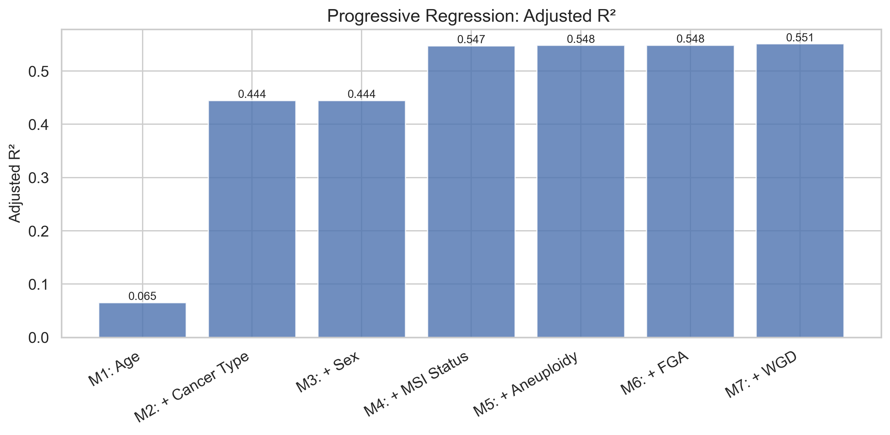

The progression reveals a clear hierarchy (Figure 10). Cancer type alone explains approximately 42-50% of the variance in log-TMB, reflecting the fundamental biological differences in mutational processes across tissue types. Adding MSI status provides the second-largest increment (approximately 10-11 percentage points), consistent with the dramatic elevation in mutation rates caused by mismatch repair deficiency. Age contributes modestly as a univariate predictor (R-squared = 0.065-0.084), reflecting the accumulation of clock-like somatic mutations over a lifetime, but much of its signal is absorbed by cancer type since age distributions differ across cancer types. Sex adds negligible explanatory power. Aneuploidy score, fraction genome altered, and WGD status each contribute small but statistically significant increments. Excluding hypermutators improves overall model fit from 0.551 to 0.624, indicating that extreme outliers degrade the linear model's ability to capture the main signal.

### 4.2 Full Model Coefficients

The full additive model on the non-hypermutator subset yields the following key coefficient estimates:

| Predictor | Coefficient | Std Error | t-statistic | p-value |
|-----------|------------|-----------|-------------|---------|
| Intercept | 2.055 | 0.062 | 33.0 | < 10^-200 |
| Sex (Male) | 0.037 | 0.013 | 2.9 | 0.004 |
| MSI status (MSS vs MSI-H) | -1.744 | 0.030 | -58.9 | < 10^-300 |
| WGD status | 0.130 | 0.017 | 7.7 | 1.3 x 10^-14 |
| Age at diagnosis | 0.005 | 0.0004 | 13.0 | 1.5 x 10^-38 |
| Aneuploidy score | -0.002 | 0.001 | -1.5 | 0.146 |
| Fraction genome altered | 0.242 | 0.034 | 7.2 | 6.7 x 10^-13 |

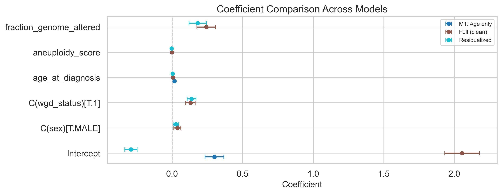

The MSI coefficient dominates: MSS tumors have log-TMB approximately 1.74 units lower than MSI-H tumors, holding all else constant. This translates to roughly a 5.7-fold difference in TMB on the original scale. Age contributes about 0.005 log-TMB units per year, meaning that a 20-year age difference corresponds to approximately a 10% increase in TMB. Whole-genome doubling is associated with a 0.13 unit increase in log-TMB, and fraction genome altered shows a positive association (0.24 per unit increase). Aneuploidy score, notably, is not significant after adjustment for the other predictors (p = 0.146), suggesting that its marginal association with TMB is largely captured by cancer type, MSI, and FGA.

### 4.3 Heteroscedasticity-Consistent Inference

The Breusch-Pagan test detects significant heteroscedasticity (LM = 693.7, p = 2.3 x 10^-123), driven by cancer types with inherently variable TMB such as melanoma and endometrial cancer. To address this, we compute HC3 heteroscedasticity-consistent standard errors. The ratio of HC3 to classical standard errors is near 1.0 for most predictors but reaches 1.67 for the MSI coefficient, indicating that classical inference substantially understates uncertainty for this variable. Crucially, no predictor changes significance status between classical and HC3 inference, confirming that the core findings are robust to heteroscedasticity.

### 4.4 Interaction Effects

Two biologically motivated interaction terms are tested via partial F-tests against the full additive model.

The age-by-cancer-type interaction is significant (F = 4.935, p = 2.2 x 10^-16) but contributes only a modest increment to explained variance (delta adjusted R-squared = +0.005). Visualization of cancer-type-specific age slopes reveals heterogeneous relationships (Figure 12): some cancer types show steep positive age-TMB slopes consistent with clock-like mutational processes, while others (notably melanoma) show flat or slightly negative slopes, consistent with exogenous mutagen-driven mutation accumulation that is less dependent on patient age. A forest plot of per-cancer-type age coefficients (Figure 13) further quantifies this heterogeneity. This pattern aligns with the hypothesis that UV-induced mutations in melanoma and tobacco-related mutations in lung cancer operate on timescales decoupled from aging.

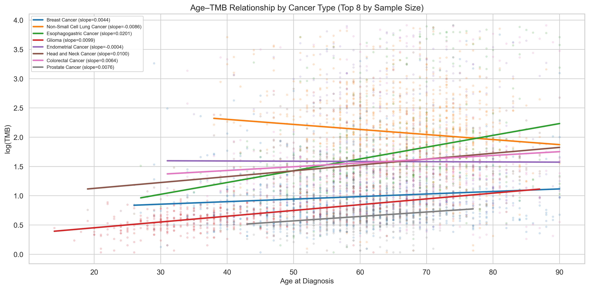

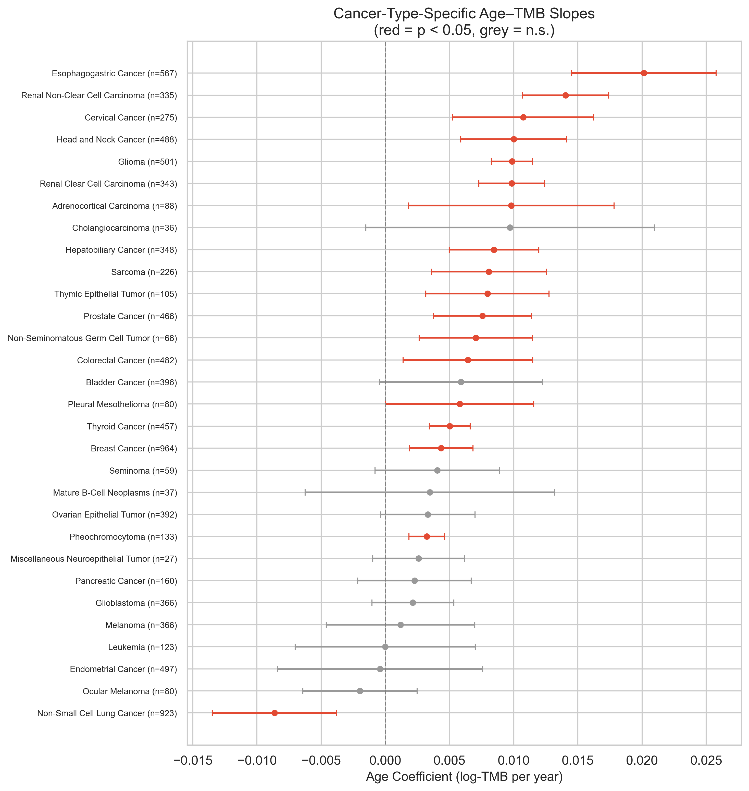

The MSI-by-aneuploidy interaction is also significant (F = 118.9, p < 10^-16, delta adjusted R-squared = +0.005). MSI-H and MSS tumors exhibit qualitatively different aneuploidy-TMB relationships (Figure 14): MSI-H tumors tend to have low aneuploidy despite very high TMB, while MSS tumors show a weak positive correlation between aneuploidy and TMB. This reflects the well-established dichotomy between microsatellite instability (point mutation-driven) and chromosomal instability (structural alteration-driven) pathways in cancer.

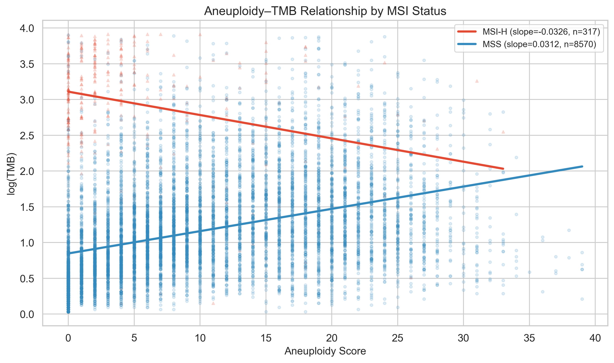

### 4.5 Residualization: Within-Type Predictor Effects

To assess whether predictors retain explanatory power after removing the dominant effects of cancer type and MSI, we fit a two-stage residualization analysis. First, log-TMB is regressed on cancer type and MSI status alone (adjusted R-squared = 0.606). The residuals from this model represent within-type, within-MSI-class variation in TMB. These residuals are then regressed on the remaining continuous and categorical predictors.

The residual model achieves an adjusted R-squared of only 0.033, indicating that age, sex, aneuploidy, FGA, and WGD together explain about 3.3% of the within-type variance in log-TMB. Coefficient estimates in the residualized model are broadly consistent with the full model (age: 0.004 vs 0.005, FGA: 0.181 vs 0.242, WGD: 0.138 vs 0.130), confirming that cancer type and MSI act primarily as intercept shifts rather than confounders of the continuous predictors. This means the continuous predictor effects are genuine within-type associations, not artifacts of between-type differences (Figure 15).

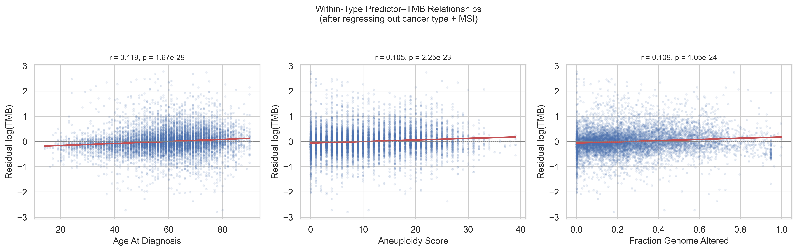

### 4.6 Multicollinearity Assessment

Variance inflation factors for the numeric predictors are all below 5 (maximum VIF = 3.36), indicating no serious multicollinearity concerns (Figure 16). Aneuploidy score and fraction genome altered are biologically correlated (both measure genomic instability), but their VIF values remain moderate, supporting their joint inclusion in the model.

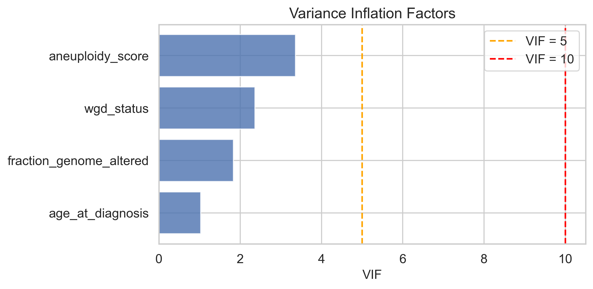

## 5. Model Diagnostics

### 5.1 Residual Behavior

Residual diagnostics reveal departures from ideal OLS assumptions that are expected given the data structure (Figures 15-16). On the full cohort, residuals exhibit substantial right-skew (skewness = 2.256) and heavy tails (excess kurtosis = 14.6), driven primarily by hypermutator samples. Excluding hypermutators markedly improves residual behavior: skewness drops to 0.572 and excess kurtosis to 4.6. While still departing from normality, this level of non-normality is unlikely to meaningfully bias coefficient estimates or standard errors at the sample sizes involved (n approximately 9,000), particularly when supplemented with HC3 robust inference.

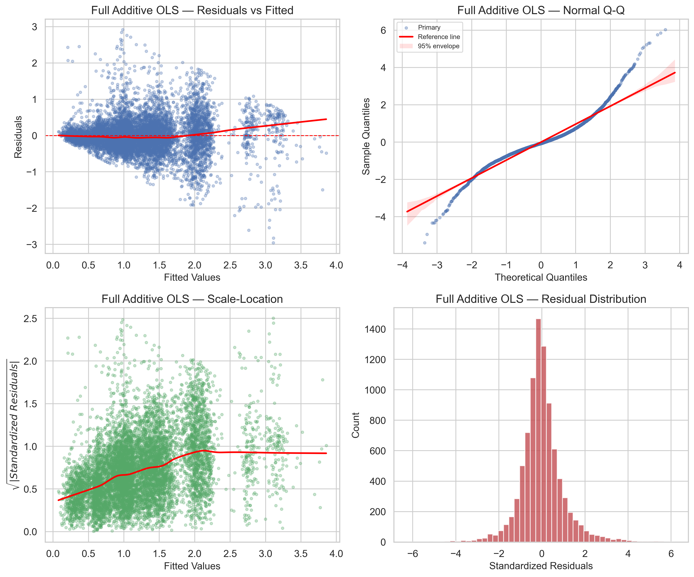

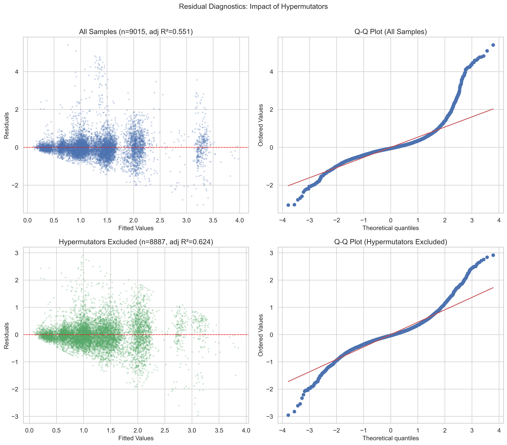

The Breusch-Pagan test confirms heteroscedasticity, with residual variance increasing for higher fitted values. This pattern reflects the biological reality that cancer types with high TMB also tend to have high TMB variance. The HC3 correction addresses this for inferential purposes without requiring model re-specification.

### 5.2 Influential Observations

Cook's distance analysis identifies a meaningful number of influential observations (Figure 19), disproportionately concentrated in melanoma (65.3% of melanoma observations exceed the 4/n threshold), mature B-cell neoplasms (35.1%), and adrenocortical carcinoma (15.9%). These cancer types have small sample sizes or extreme TMB values that exert outsized leverage on the regression surface. DFBETAS analysis confirms that individual observations can meaningfully shift the age coefficient, though no single observation dominates the overall fit (Figure 20).

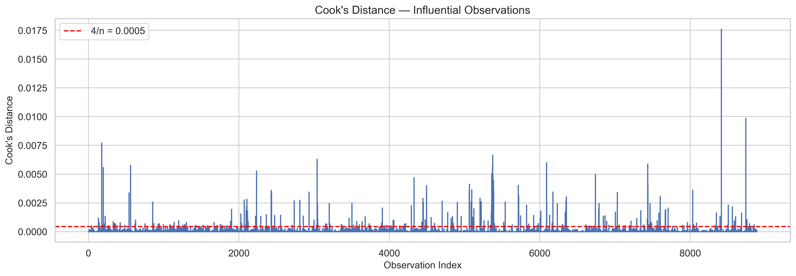

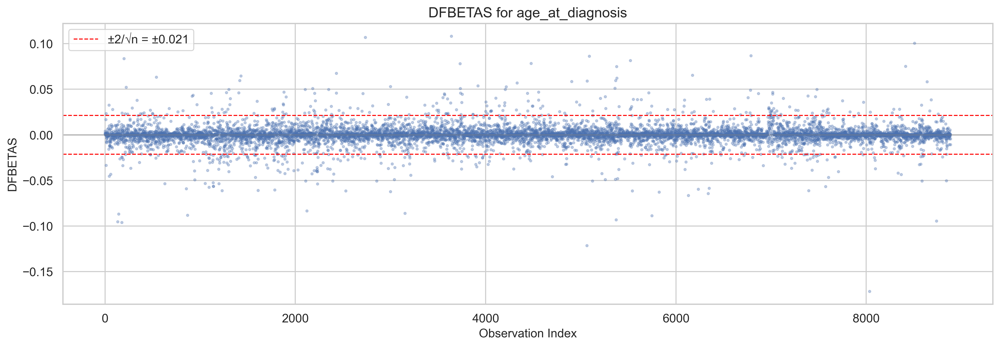

### 5.3 Robust Regression

Huber M-estimator robust regression downweights influential observations and provides a sensitivity check on OLS coefficient estimates (Figure 21). Most coefficients shift by less than 10% between OLS and robust estimation (WGD: -0.6%, FGA: -3.0%, age: -10.2%), confirming stability. The MSI coefficient shifts by 12.9% (from -1.74 to -1.97), suggesting that the robust estimator assigns slightly more weight to the majority of MSS observations. The sex coefficient shows the largest relative change (44.8%), though both estimates are small in absolute magnitude (0.037 OLS vs 0.020 robust), and the variable is marginally significant in either case.

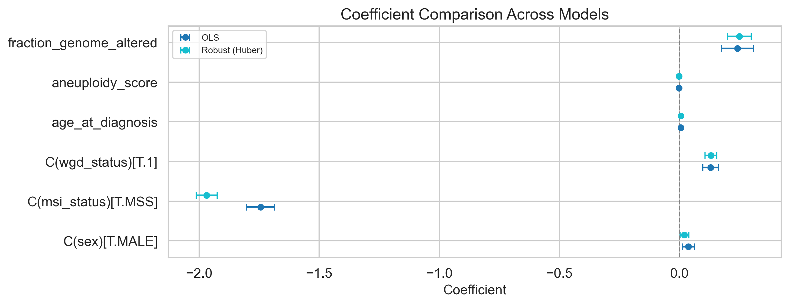

### 5.4 Sensitivity Analysis

Excluding melanoma and endometrial cancer, the two cancer types with the most extreme TMB distributions, reduces the cohort to 8,447 observations and the adjusted R-squared from 0.624 to 0.611. Coefficient estimates remain stable: the MSI coefficient shifts from -1.74 to -1.67, age from 0.0054 to 0.0056, and FGA from 0.24 to 0.30. This confirms that the model is not driven by a small number of cancer types with extreme TMB.

## 6. Logistic Regression Results

### 6.1 Standard Logistic Regression

A standard logistic regression model predicts TMB-high status (>= 10 mut/Mb) from the same seven-predictor set. The model is fit on 9,251 complete cases and achieves an AUC of 0.911 (Figure 22), indicating good discrimination between TMB-high and TMB-low tumors. At the default 0.5 probability threshold, the model achieves 92.5% accuracy (Figure 23), with high specificity (99% for TMB-low) but moderate sensitivity (36% for TMB-high), reflecting the class imbalance (11.6% prevalence).

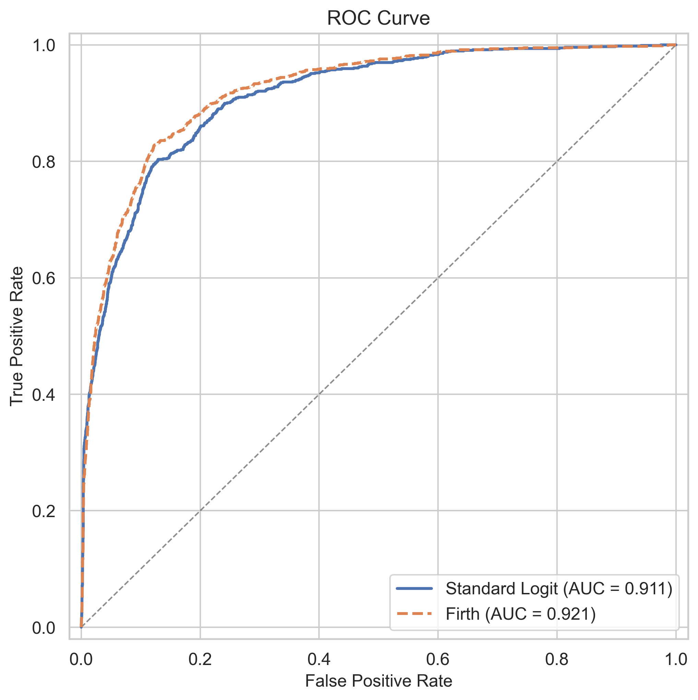

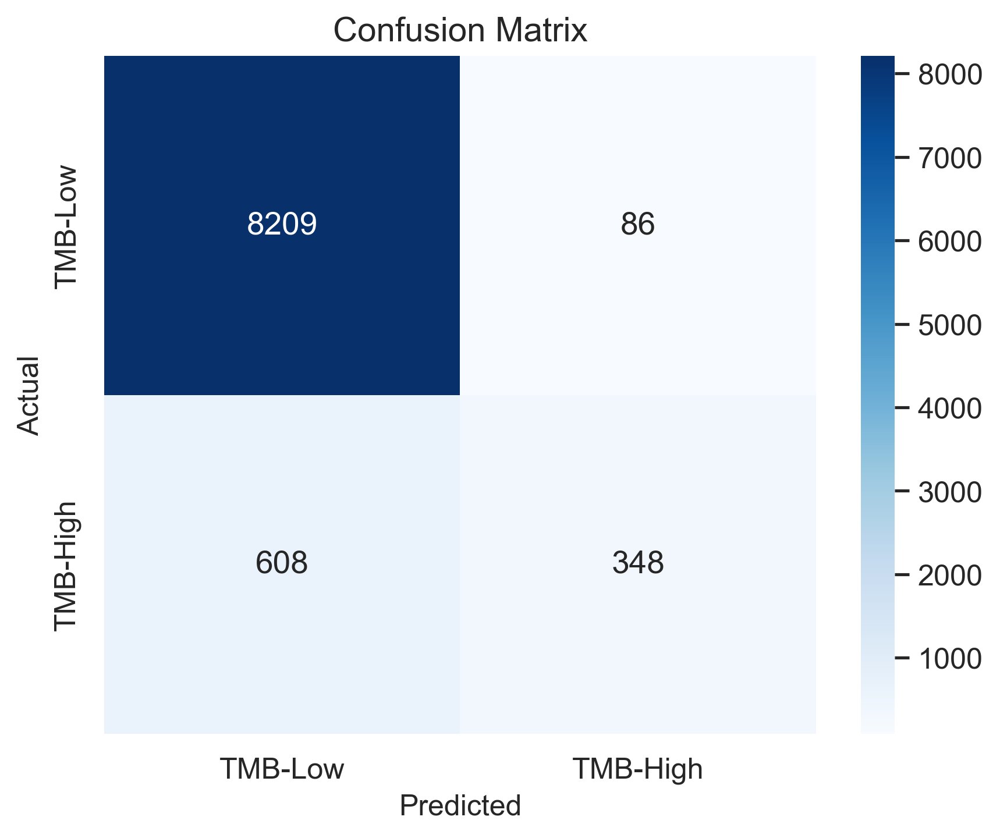

Standard logistic regression encounters numerical difficulties in this dataset. Five cancer types have 0% TMB-high prevalence (pleural mesothelioma, seminoma, pheochromocytoma, non-seminomatous germ cell tumors, and miscellaneous neuroepithelial tumors), and an additional nine types have prevalence below 2%. This quasi-complete separation causes the standard MLE to diverge for the corresponding cancer-type coefficients, producing NaN standard errors and confidence intervals.

### 6.2 Firth's Penalized Logistic Regression

Firth's bias-corrected logistic regression addresses the separation problem by adding a Jeffreys-prior penalty to the likelihood function, which shrinks coefficient estimates toward zero and ensures finite estimates even in separated strata. The Firth model converges in 14 iterations on the full design matrix (36 predictors after dummy encoding) and achieves an AUC of 0.921, slightly exceeding the standard logistic model. All standard errors and p-values are finite, enabling proper inference across all cancer types.

The Firth model produces somewhat different coefficient estimates than standard logistic regression for variables involved in separation (primarily cancer type indicators), while coefficients for well-identified predictors like MSI status and age remain similar. The Firth odds ratio for MSS versus MSI-H is approximately exp(-4.73) = 0.009, confirming that MSS tumors have dramatically lower odds of being TMB-high.

### 6.3 Calibration and Goodness of Fit

The Hosmer-Lemeshow test yields a chi-squared statistic of 13.48 (df = 8, p = 0.096), indicating adequate calibration at the 5% significance level. The calibration curve (Figure 24) shows reasonable agreement between predicted probabilities and observed event rates, though the model tends to slightly underestimate TMB-high probability in the highest-risk decile.

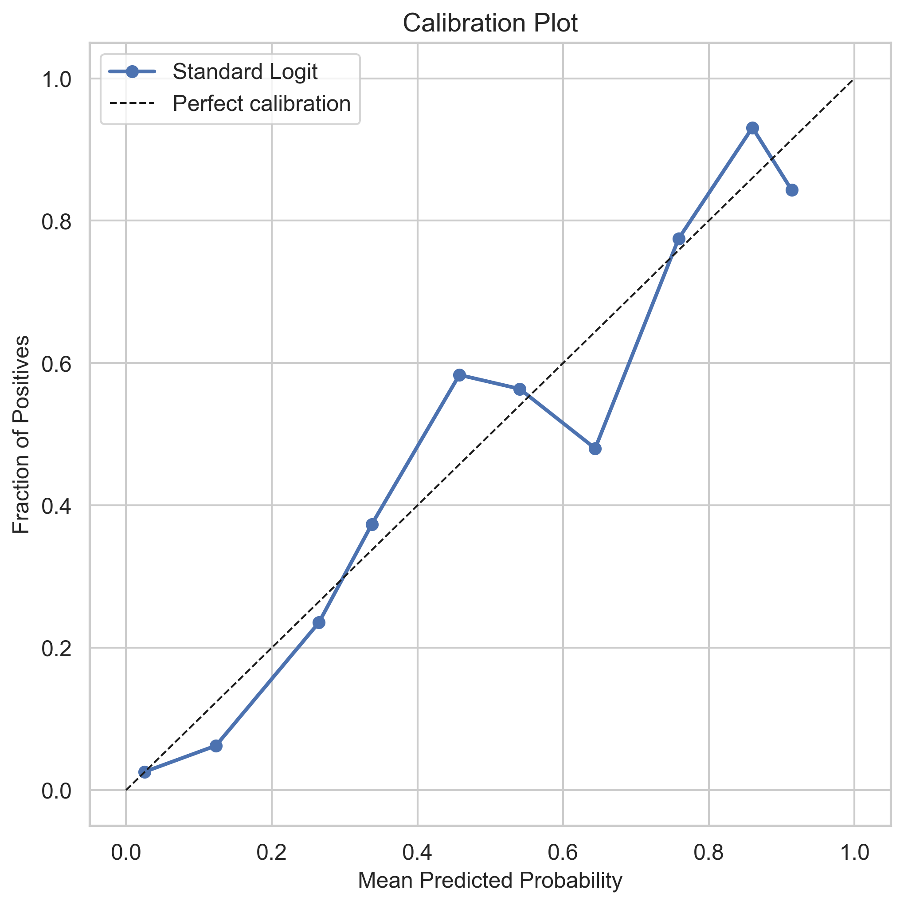

Likelihood ratio tests confirm that the full predictor set contributes significantly beyond a null model (chi-squared = 3,787, df = 34, p approximately 0) and that predictors beyond cancer type add meaningful information (chi-squared = 1,622, df = 5, p approximately 0).

## 7. Clinical Implications

The logistic model's AUC of 0.911-0.921 suggests that routinely available clinical and genomic features can approximate TMB-high status without full exome sequencing. MSI status emerges as the single most actionable predictor: MSI-H tumors have dramatically elevated odds of TMB-high, and MSI testing is widely available via immunohistochemistry or PCR. Patients with MSI-H tumors could be prioritized for comprehensive genomic profiling or directly considered for immunotherapy.

Cancer type provides a strong prior probability for TMB-high status. Melanoma, non-small cell lung cancer, bladder cancer, and endometrial cancer have greater than 20% TMB-high prevalence and may warrant more aggressive sequencing strategies. Conversely, germ cell tumors, pheochromocytoma, and mesothelioma have near-zero prevalence, suggesting that TMB testing in these contexts is unlikely to change management.

Age and genomic instability features (aneuploidy, FGA, WGD) add modest incremental signal after cancer type and MSI are known, but alone are insufficient for clinical decision-making. The class imbalance in this cohort (11.5% TMB-high) means that at a standard 0.5 threshold, the model favors specificity over sensitivity. In a clinical setting where the cost of missing an immunotherapy-eligible patient is high, a lower probability threshold would be appropriate, trading specificity for improved sensitivity.

## 8. Limitations

Several limitations should be considered when interpreting these results. First, this analysis uses in-sample evaluation only; cross-validated or externally validated performance estimates would be lower. Second, the TMB definition used here (mutation count divided by an assumed 30 Mb exome capture size) is a proxy that may differ from clinical TMB assays such as FoundationOne CDx, which use different pipelines and panel sizes. Third, missingness is non-uniform across predictors, with MSI-related fields showing the highest rates, and complete-case analysis may introduce selection bias if missingness is not completely at random. Fourth, pan-cancer aggregation masks subtype-specific biology; pooled regression coefficients should not be interpreted as universal within every disease context. Fifth, potential residual confounding remains across the heterogeneous TCGA population, and unmeasured variables such as specific mutational signatures or treatment history may influence TMB. Finally, the Shapiro-Wilk test rejects residual normality (p < 10^-40), though at sample sizes of approximately 9,000, OLS coefficient estimates and HC3-corrected inference remain reliable despite moderate departures from normality.

## 9. Relation to Project Proposal

This final report closely follows the analysis plan outlined in the original project proposal. The proposal specified five phases: data preparation (merging three TCGA datasets), exploratory data analysis, progressive linear regression with interaction terms, logistic regression with Firth's bias correction, and model diagnostics. All five phases were completed as proposed. The key research questions — quantifying the relative contributions of clinical and genomic features to TMB variation, evaluating TMB-high classification performance, and assessing sensitivity to outliers — are addressed directly.

Two aspects of the analysis evolved during execution. First, the proposal anticipated using the `firthlogist` Python package for Firth's penalized logistic regression, but this package was incompatible with the project's Python 3.11 environment. Instead, we implemented Firth's method from scratch using iteratively reweighted least squares with a Jeffreys-prior bias correction, with Wald-type standard errors derived from the final Fisher information matrix. This custom implementation provided equivalent functionality with the additional benefit of full transparency into the optimization procedure. Second, the proposal mentioned regressing out cancer type to reveal within-type relationships but did not specify how to visualize or validate this step. We added a two-stage residualization analysis with scatter plots (Figure 15) to make the within-type predictor effects explicit, which strengthened the interpretation that age and genomic instability features are not merely proxies for cancer type.

All other analyses — progressive model building, interaction F-tests with group-specific regression lines, HC3 robust inference, Cook's distance and DFBETAS diagnostics, robust regression comparison, sensitivity analysis excluding extreme cancer types, ROC/AUC evaluation, calibration assessment, and clinical discussion — were completed as proposed.

## 10. Conclusion

This analysis provides a systematic quantification of the clinical and genomic determinants of tumor mutational burden across 30 cancer types in the TCGA Pan-Cancer cohort. Cancer type and MSI status together explain over 60% of the variance in log-transformed TMB, establishing these as the dominant predictors. Age contributes a modest clock-like signal that varies in magnitude across cancer types, consistent with tissue-specific differences in mutational processes. Genomic instability features add small but significant incremental explanatory power. For TMB-high classification, Firth's penalized logistic regression achieves an AUC of 0.921 while providing stable inference in cancer subtypes with complete separation, making it the preferred approach for this application. These findings support the use of MSI status and cancer type as a first-line triage tool for identifying patients likely to benefit from TMB-guided immunotherapy, potentially reducing the need for comprehensive genomic profiling in low-probability populations.

## References

1. Liu, J., Lichtenberg, T., Hoadley, K. A., et al. (2018). An Integrated TCGA Pan-Cancer Clinical Data Resource to Drive High-Quality Survival Outcome Analytics. *Cell*, 173(2), 400-416.
2. Taylor, A. M., Shih, J., Ha, G., et al. (2018). Genomic and Functional Approaches to Understanding Cancer Aneuploidy. *Cancer Cell*, 33(4), 676-689.
3. Hoadley, K. A., Yau, C., Hinoue, T., et al. (2018). Cell-of-Origin Patterns Dominate the Molecular Classification of 10,000 Tumors from 33 Types of Cancer. *Cell*, 173(2), 291-304.
4. Samstein, R. M., Lee, C. H., Shoushtari, A. N., et al. (2019). Tumor Mutational Burden Predicts Response to Immune Checkpoint Blockade. *Nature Genetics*, 51(2), 202-206.
5. Chalmers, Z. R., Connelly, C. F., Fabrizio, D., et al. (2017). Analysis of 100,000 Human Cancer Genomes Reveals the Landscape of Tumor Mutational Burden. *Genome Medicine*, 9(1), 34.
6. Marabelle, A., Fakih, M., Lopez, J., et al. (2020). Association of Tumour Mutational Burden with Outcomes in Patients with Advanced Solid Tumours Treated with Pembrolizumab. *The Lancet Oncology*, 21(10), 1353-1365.

## Reproducibility

All analyses are implemented in Python 3.11 using Jupyter notebooks with the following execution order:

1. `notebooks/01_data_preparation.ipynb` -- data download, merge, and feature engineering
2. `notebooks/02_eda.ipynb` -- exploratory analysis and visualization
3. `notebooks/03_linear_regression.ipynb` -- progressive OLS, interactions, residualization
4. `notebooks/04_logistic_regression.ipynb` -- standard and Firth logistic regression
5. `notebooks/05_diagnostics.ipynb` -- residual diagnostics, robust regression, sensitivity

Reusable functions are provided in `src/data_loader.py`, `src/preprocessing.py`, `src/stats.py`, and `src/plotting.py`. Environment management is specified in `environment.yml`. All figures are saved to the `figures/` directory in both PNG and PDF formats.
